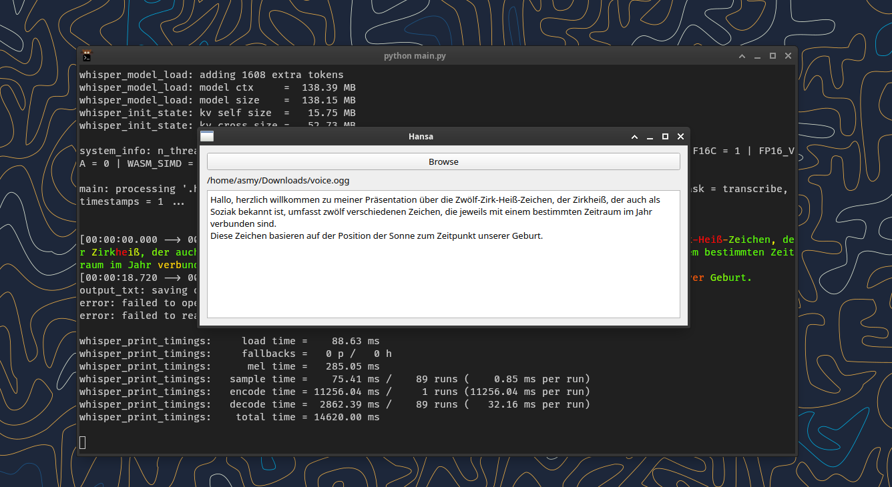

# Hansa
A simple speech-to-text program using a whisper.cpp fork, a custom german fine-tuned model and Python.

Also, to use the model download it here [GGML German Model](https://usama.pro/public/german_q4_0.bin) 
